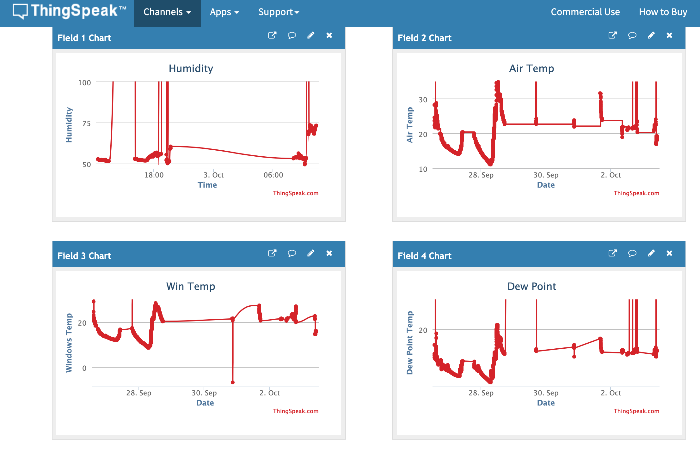

# Window-Condensation-Sensor

Project using a Particle Photon, HTU21 Humidity Sensor and MLX90614 Temperature sensor to calculate when condensation will form on a window pane.

When condensation is predicted a command is then send to the Philips Hue Hub to turn on a fan and reduce the moisture in the air.

## Set Up
The current version requires that you manually enter the IP address of the Philips hue hub, which can be found by typing https://discovery.meethue.com/ into your webbrowers and this will return IP address.

```json
[{"id":"001799fffe4893b6","internalipaddress":"192.168.0.23"}]
```

```cpp
char httpserverAddress[] = "192.168.0.23";  // server address
```
### ThingSpeak
Futher information can be found on the Philips Hue website https://developers.meethue.com/develop/get-started-2/

I put this on my todo list to build this into the software.


The current version of the software also requires you to have a thingspeak account, although this can be commented out if you do not want to analysis the data from the sensors. https://thingspeak.com



Once you have setup you account you need to populate the API key and channel number into the source code.

```cpp
char mqttUserName[] = "Window Condensation";    // Can be any name.
char mqttPass[] = "XXXXXXXXXXXX";        // Change this to your MQTT API Key from Account > My Profile.
char writeAPIKey[] = "XXXXXXXXXXXXX";     // Change this to your channel Write API Key.
long channelID = XXXXXXX;                     // Change this to your channel number.
```

### Hue Philips Deivce Setup
The next customisation that is required is to setup the Hue device number that you want to control.

```cpp
String lightnumber = "15";
```

This is not that easy to find on the Philips Hue app and I have the Hue Lights app to find the number.


### Components Required

  Sensor|Device|
  --------|-----
  [HTU21D](https://www.adafruit.com/product/1899)|HTU21D Board
  [MLX90614](https://www.adafruit.com/product/1747)|Melexis Contact-less Infrared Sensor - MLX90614 3V
  [Particle Photon](https://www.sparkfun.com/products/13774)|Particle Photon (Headers)
 


